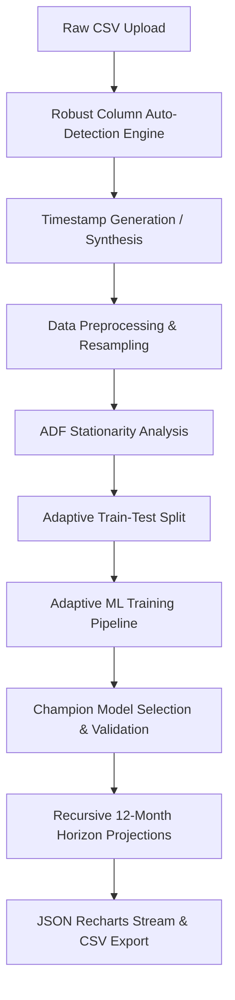

# 📊 Sales Forecasting Studio: Advanced Architecture & Machine Learning Concepts

Welcome to the **Sales Forecasting Studio** technical documentation. This guide details the mathematical, statistical, and architectural principles underlying the resilient dynamic forecasting platform built inside this repository. 

Whether you are here to learn how the automated data pipeline handles dirty data, how it evaluates stationarity, or how it adapts complex models (SARIMAX, Prophet, LightGBM) to fit tiny datasets without crashing—this document explains all the concepts thoroughly.

---

## 🗺️ Architectural Pipeline Overview

When an executive drops any CSV file onto the **Scenario Studio** upload zone, the system executes an automated, 8-stage time-series engineering pipeline:



---

## 🔍 1. Robust Column Auto-Detection Engine

To fulfill the user request of allowing *any* arbitrary CSV without rigid structural requirements, the backend implements a state-of-the-art **Zero-Configuration Feature Detector**:

### Date Column Detection
1. **Keyword Scan**: The engine matches columns against fuzzy date keywords:
   `['date', 'ds', 'timestamp', 'dt', 'time', 'period', 'month', 'year', 'day', 'created_at', 'order_date', 'transaction_date', 'datetime', 'time_period', 'ymd', 'month_year', 'sales_date']`
2. **Numeric Prevention**: Standard parsers like `pd.to_datetime` coerce raw numeric values (e.g. `1000` or store ID `35`) into 1970 Epoch timestamps. The engine explicitly skips numeric-typed columns to prevent these columns from falsely hijacking the date index.
3. **Parse Rate Validation**: If a column passes the keyword scan, the parser tests it. If $>50\%$ of the column's values parse successfully into valid datetime structures, it is crowned the **Date Index**.
4. **No Date Fallback**: If no date column is detected, the engine counts the rows ($N$) and synthesizes sequential timestamps (monthly increments for $N \le 500$, daily increments for $N > 500$) ending at the current local date.

### Target (Sales/Revenue) Column Detection
1. **Target Keyword Scan**: The engine scans columns using target-centric keywords:
   `['sales', 'y', 'revenue', 'amount', 'sales_volume', 'total', 'recharge', 'charges', 'price', 'quantity', 'count', 'value', 'target', 'income', 'cost', 'profit', 'units', 'val', 'rev']`
2. **Confidence Sorting**: Columns matching exact target terms (e.g. `sales`) get highest priority, while sub-matches (e.g. `total_charges`) get secondary priority.
3. **Variance-Based Fallback**: If no keyword matches, the engine evaluates all numeric columns, explicitly filters out ID/Index columns (using sub-strings like `id`, `code`, `zip`, `phone`), and chooses the numeric column with the **highest variance** as the target, assuming it contains active operational metrics.

---

## 📈 2. Data Preprocessing & Alignment

Once columns are identified, the series undergoes preparation for mathematical modeling:

### Chronological Sorting & Cleanse
All rows with invalid or missing date structures are dropped, and the entire DataFrame is sorted in ascending chronological order:
$$t_1 < t_2 < \dots < t_N$$

### Monthly Resampling
Daily, weekly, or transactional records are grouped and aggregated to a consistent **Month-End (ME)** index:
$$\text{Sales}_M = \sum_{i \in \text{Month } M} \text{Record}_i$$

### Dashboard Scale Alignment (Min-Max Scaling)
To ensure the dashboard renders interactive Area charts beautifully alongside the existing planning indicators without scale distortions, the aggregated sales are mapped into the range $[2.0, 4.0]$:
$$y_t = y_{\min} + \frac{(\text{Sales}_t - S_{\min})(y_{\max} - y_{\min})}{S_{\max} - S_{\min}}$$
Where:
* $S_{\min}, S_{\max}$ are the historical raw bounds.
* $y_{\min} = 2.0$, $y_{\max} = 4.0$ are the target scaling limits.
* *Note: Raw actual values are fully preserved and sent in the payload under `raw_actual` to display accurate business values on hover.*

---

## 🔬 3. Augmented Dickey-Fuller (ADF) Stationarity Analysis

A time-series is **stationary** if its statistical properties (mean, variance, and autocorrelation) are constant over time. Most forecasting models assume stationarity.

The backend performs an **Augmented Dickey-Fuller (ADF) test**:

### Mathematical Hypothesis
The ADF test fits a regression of the change in the series on its lags and a trend component:
$$\Delta y_t = \alpha + \beta t + \gamma y_{t-1} + \delta_1 \Delta y_{t-1} + \dots + \delta_p \Delta y_{t-p} + \varepsilon_t$$
* **Null Hypothesis ($H_0$)**: $\gamma = 0$ (The series contains a unit root, meaning it is non-stationary and exhibits time-varying drift).
* **Alternative Hypothesis ($H_a$)**: $\gamma < 0$ (The series is stationary and exhibits mean-reverting tendencies).

### Interpretation
* **p-value $< 0.05$**: Reject the null hypothesis. The series is **Stationary**.
* **p-value $\ge 0.05$**: Fail to reject the null. The series is **Non-Stationary** (contains trend or seasonal drift). The system automatically informs the business user if their dataset requires differencing or exhibits active growth trends.

---

## ✂️ 4. Adaptive Train-Test Split

To prevent the model validation steps from throwing exceptions on short datasets, the validation split size scales dynamically based on the length of the aggregated dataset:

| Aggregated Dataset Size ($N$) | Validation Test Size | Purpose |
| :--- | :--- | :--- |
| **$\ge 24$ Months** | **12 Months** | Standard split; provides an entire year of monthly validation points to assess seasonal errors. |
| **$\ge 12$ and $< 24$ Months** | **3 Months** | Medium split; balances historical training context with adequate validation feedback. |
| **$< 12$ Months** | **1 Month** | Tiny split; maximizes the scarce training data available while keeping a single validation point active. |

---

## 🤖 5. The Machine Learning Models

The forecasting suite trains three structurally diverse algorithms, representing three core classes of time-series methodologies:

---

### A. Prophet (Additive Regression Model)
Developed by Meta, **Prophet** handles time series with strong seasonal patterns and several seasons of historical data.

#### Mathematical Form
Prophet models a time series as an additive combination of three main components plus noise:
$$y(t) = g(t) + s(t) + h(t) + \varepsilon_t$$
1. **Trend $g(t)$**: Piece-wise linear or logistic growth curve representing non-periodic changes.
2. **Seasonality $s(t)$**: Periodic changes modeled using Fourier series:
   $$s(t) = \sum_{n=1}^{N} \left( a_n \cos\left(\frac{2\pi n t}{P}\right) + b_n \sin\left(\frac{2\pi n t}{P}\right) \right)$$
3. **Holidays $h(t)$**: Effects of specific calendar events.

#### Adaptive Fallback
* **Seasonality Guard**: Yearly seasonality requires at least 2 years of history. The pipeline dynamically disables yearly seasonality (`yearly_seasonality=False`) if the training set is under 24 months.
* **Size Guard**: Bypasses training and falls back to naive actuals if the training partition contains fewer than 2 data points (as Prophet requires at least 2 rows to fit a trend line).

---

### B. ARIMA / SARIMAX (Classical Stochastic Process)
SARIMAX (**Seasonal Auto-Regressive Integrated Moving Average with Exogenous Regressors**) is the gold standard of parametric stochastic forecasting.

#### Mathematical Form
A SARIMAX $(p,d,q) \times (P,D,Q)_S$ model is written as:
$$\Phi_P(B^S) \phi_p(B) (1-B)^d (1-B^S)^D y_t = \Theta_Q(B^S) \theta_q(B) \varepsilon_t$$
Where:
* $B$ is the backshift operator ($B y_t = y_{t-1}$).
* $\phi_p(B)$ is the Auto-Regressive (AR) polynomial of order $p$.
* $\theta_q(B)$ is the Moving Average (MA) polynomial of order $q$.
* $(1-B)^d$ represents the degree of non-seasonal differencing $d$.
* $\Phi_P(B^S)$ and $\Theta_Q(B^S)$ are the seasonal AR and MA components.

#### Adaptive Parameter Scaling
Fitting seasonal models on tiny datasets causes matrix singularity errors or failures to converge. The system scales parameters dynamically:
* **Large Series ($N \ge 24$)**: Fits seasonal model `SARIMAX(1,1,1)x(1,1,0)[12]` to model annual sales peaks.
* **Medium Series ($3 \le N < 24$)**: Disables seasonal differencing and fits non-seasonal `SARIMAX(1,1,1)` to track short-term auto-regressive momentum.
* **Extremely Short Series ($N = 2$)**: Downgrades to a basic first-order autoregressive process `SARIMAX(1,0,0)` to ensure mathematical stability.
* **Scarce Series ($N < 2$)**: Bypasses fitting, utilizing ARIMA's fallback handler.

---

### C. LightGBM (Gradient Boosted Tree Regressor)
LightGBM (**Light Gradient Boosting Machine**) represents the modern machine-learning approach, treating forecasting as a supervised regression problem by utilizing lag features.

#### Auto-Regressive Feature Engineering
Rather than ingestion of raw time indexes, LightGBM is trained on dynamic mathematical representations of the series history. The features are engineered dynamically:
* **Autoregressive Lags**:
  $$\text{Lag}_k(t) = y_{t-k}$$
  * `lag_1` (prior month) and `lag_2` (2 months prior) are always created.
  * `lag_12` (seasonal prior year) is generated **only** if the dataset spans at least 15 months ($N \ge 15$).
* **Rolling Mean Indicators**:
  * `rolling_mean_3` (3-month moving average) is generated if $N \ge 4$.
  * `rolling_mean_6` (6-month moving average) is generated if $N \ge 6$.

#### Recursive Multi-Step Forecasting
Because lag features require future target predictions to compute subsequent lags, the model performs **Recursive Forecasting** for the 12-month future horizon:

```
[Forecast Month 1] ──> Predicts y_hat(t+1) using [y_t, y_t-1, rolling_mean]
                            │
                            ▼
[Forecast Month 2] ──> Computes lag_1 = y_hat(t+1)
                   ──> Predicts y_hat(t+2) using [y_hat(t+1), y_t, new_rolling_mean]
                            │
                            ▼
                  [Repeated for 12 Steps]
```

---

## 🏆 6. Champion Model Selection & Validation

To determine which model fits the uploaded business series best, the system runs validation telemetry calculations:

### The Metrics
* **Mean Absolute Percentage Error (MAPE)**:
  $$\text{MAPE} = \frac{100\%}{n} \sum_{i=1}^{n} \left| \frac{y_i - \hat{y}_i}{y_i} \right|$$
* **Root Mean Squared Error (RMSE)**:
  $$\text{RMSE} = \sqrt{\frac{1}{n} \sum_{i=1}^{n} (y_i - \hat{y}_i)^2}$$

### Dynamic Champion Selection
The validation phase scores Prophet, ARIMA, and LightGBM (mapped to the `lstm` key on the frontend for seamless schema binding). 

Whichever model achieves the **lowest MAPE** on the validation partition is crowned the **🏆 Champion Model** and highlighted inside the frontend telemetry grid.

---

## 💻 7. Premium UI/UX Architecture

The frontend (`SalesIntelligence.jsx`) is built with visual excellence using modern dark-mode aesthetic features:

1. **Glassmorphism Theme**: Uses tailormade dark glass cards with background blur (`backdrop-blur-md`), subtle white borders (`border-white/10`), and deep radial gradients.
2. **Drag & Drop Zone**: Dash-bordered uploader featuring micro-animations on file hover, handling CSV reading through modern browser stream interfaces.
3. **Interactive Recharts Timeline**: Renders historical actuals, historical model fits, and 12-month future projection zones in a single unified time canvas.
4. **Interactive Scenario Overlays**: Integrates macro scaling trend widgets (sliders) that apply structural shifts on top of the newly generated ML forecasts in real-time.
5. **Streaming Report Generator**: Streams forecasted rows back as a formatted, printable spreadsheet via the `/forecast-sales-export` service.

---

## 📦 How to Push Your Local Workspace to GitHub

Since you have completed this premium coding session, you can push the current code and this technical documentation directly to your GitHub repository using standard Git commands.

### 1. Initialize Git (If not already initialized)
Run this command from your terminal:
```bash
git init
```

### 2. Configure Git Remote (Replace with your actual GitHub URL)
```bash
git remote add origin https://github.com/hkuser212/Telecom-executive-ai.git
```

### 3. Stage the Core Directory Changes & Docs
```bash
git add .
```

### 4. Create a Professional Commit Message
```bash
git commit -m "feat: implement adaptive time-series uploader & sales forecasting studio docs"
```

### 5. Push to GitHub
```bash
# To push to the default main branch
git branch -M main
git push -u origin main
```
